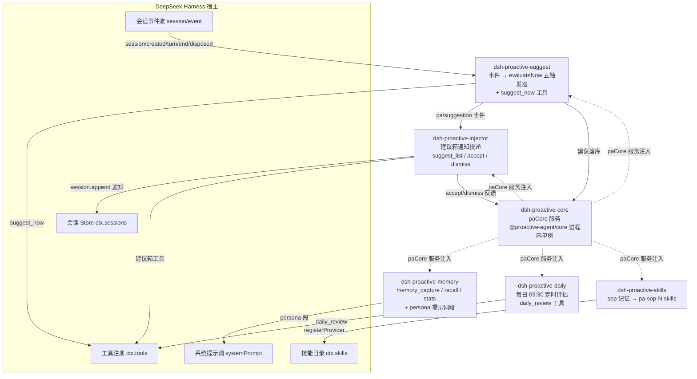

# pa-dsh — ProactiveAgent × DeepSeek Harness 插件组

把 [ProactiveAgent](https://github.com/ConradLu2740/ProactiveAgent)（主动记忆 + 主动建议系统）
做成 DeepSeek Harness（dsh）的 cordis 插件组。**引擎零重写**，全部复用
`@proactive-agent/core`，通过 cordis 服务注入。

## 架构



**事件流**：dsh 会话事件（`session/created` → `session_start` 存量推送；`turn/end` →
`session_mid` 强信号建议；`session/disposed` → `session_end` 完整评估；`suggest_now` →
`manual`；每日定时 → `timer`）→ suggest 插件评估 → `pa/suggestion` 事件 → injector
投递建议箱通知 → 用户接受/忽略 → 反馈回流 core（状态、类型权重持久化）。

## 插件一览（已发布 npm，v0.1.0）

| 包 | 职责 |
| --- | --- |
| [@proactive-agent/dsh-proactive-core](https://www.npmjs.com/package/@proactive-agent/dsh-proactive-core) | 引擎单例宿主：唯一 import `@proactive-agent/core`，以 `paCore` 服务提供 memory/suggest |
| [@proactive-agent/dsh-proactive-memory](https://www.npmjs.com/package/@proactive-agent/dsh-proactive-memory) | 原生记忆工具（capture/recall/stats）+ 用户画像提示词段 |
| [@proactive-agent/dsh-proactive-suggest](https://www.npmjs.com/package/@proactive-agent/dsh-proactive-suggest) | 主动建议引擎：session 事件 → evaluateNow 五触发器 |
| [@proactive-agent/dsh-proactive-injector](https://www.npmjs.com/package/@proactive-agent/dsh-proactive-injector) | 建议箱 + 反馈闭环（suggest_list/accept/dismiss） |
| [@proactive-agent/dsh-proactive-daily](https://www.npmjs.com/package/@proactive-agent/dsh-proactive-daily) | 每日 09:30 定时回顾 + daily_review 工具 |
| [@proactive-agent/dsh-proactive-skills](https://www.npmjs.com/package/@proactive-agent/dsh-proactive-skills) | sop 记忆 → dsh skills（pa-sop-N 动态目录） |

## 安装到 dsh profile（官方 bundle 形态，推荐）

```bash
# 一条命令：自动安装 6 包 + 应用 cordis.patch.yml 层
dsh plugin --profile web add @proactive-agent/dsh
```

## 细粒度安装（高级，逐个启用）

```bash
cd ~/.dsh/profiles/web
pnpm add @proactive-agent/dsh-proactive-core @proactive-agent/dsh-proactive-memory @proactive-agent/dsh-proactive-suggest @proactive-agent/dsh-proactive-injector @proactive-agent/dsh-proactive-daily @proactive-agent/dsh-proactive-skills
```

在 `~/.dsh/profiles/web/cordis.patch.yml` 添加（**pa-core 必须排最前**，内容同 bundle 包的 cordis.patch.yml）：

```yaml
- insert:
    - id: pa-core
      name: '@proactive-agent/dsh-proactive-core'
      config: {}
    - id: pa-memory
      name: '@proactive-agent/dsh-proactive-memory'
      config: { personaOrder: 5 }
    - id: pa-suggest
      name: '@proactive-agent/dsh-proactive-suggest'
      config: {}
    - id: pa-injector
      name: '@proactive-agent/dsh-proactive-injector'
      config: { notifyOnSuggestion: true }
    - id: pa-daily
      name: '@proactive-agent/dsh-proactive-daily'
      config: { dailyAt: '09:30' }
    - id: pa-skills
      name: '@proactive-agent/dsh-proactive-skills'
      config: { maxSkills: 10 }
```

重启 dsh 即生效。记忆库默认 `~/.proma-proactive/`（与 Claude Code 版 PA 共享）。

## 开发

```bash
pnpm install
node scripts/build.mjs          # esbuild 构建全部插件到 packages/*/lib/
```

## 发布到 npm（在你终端运行，2FA 为 WebAuthn）

```bash
bash scripts/publish.sh          # patch 版本（可 minor / major），含 bundle 聚合包
```

每个包发布时按 Enter 打开浏览器 → 指纹授权。随后升级 dsh profile：

```bash
cd ~/.dsh/profiles/web && pnpm add @proactive-agent/dsh-proactive-xxx@新版本
```

## 文档

- `PROPOSAL.md` — 12 节完整方案（架构、触发器映射、分阶段实施）
- `IMPLEMENTATION.md` — 实施总结、验证链路、踩坑记录、已知待办
